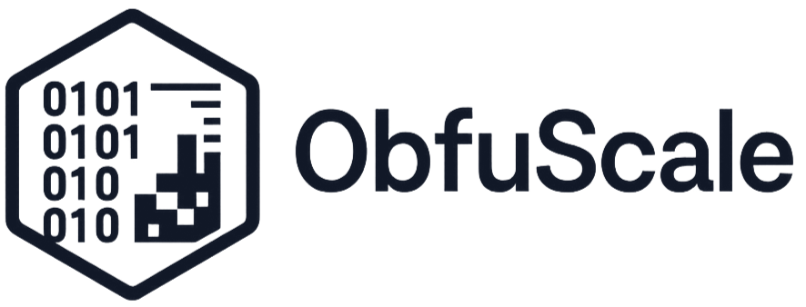

  <picture>
    <!-- Dark mode: show the LIGHT logo -->
    <source media="(prefers-color-scheme: dark)" srcset="docs/assets/obfuscale-logo-light.png">
    <!-- Light mode (default): show the DARK logo -->
    
  </picture>

# obfuscale

ObfuScale provides a consistent "yardstick" for measuring the impact of obfuscation on malware detection models. 
It introduces a reproducible obfuscation ladder (L0–L3), converts binaries into byteplot images, 
and benchmarks convolutional neural networks (ResNet, ConvNeXt) across representation choices and 
exposure policies. The framework validates obfuscation difficulty using a challenge score based on 
Jensen–Shannon divergence, ensuring that each level reflects a measurable increase in complexity.
